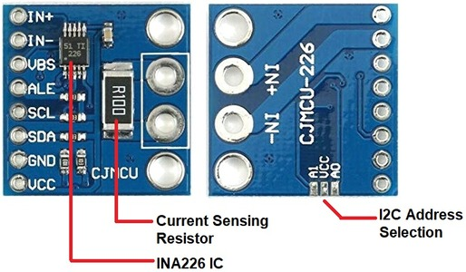

# Checklist de Transformação: Nobreak Smart

Este documento contém a listagem de todas as etapas necessárias para a modificação do nobreak. 
Ele será estruturado e detalhado conforme formos alinhando cada parte do projeto.

## 🛠️ 1. Planejamento e Lista de Materiais
- [ ] Definir o modelo exato do Nobreak (base: ~600 VA, entrada 220V / saída 110V).
- [ ] Obter microcontrolador principal: **ESP32 DevKit V1 (38 pinos)**.
- [ ] Obter Módulo Regulador de Tensão: **LM2596 (Buck Converter DC-DC)** para alimentar o ESP32 a partir da bateria do nobreak.
- [ ] Obter Sensor de Rede AC: **HLW8032** (Dar preferência absoluta ao modelo **HLW8032_AC_CHECK_V1.1** que possui optoacoplador/fotoacoplador integrado, permitindo isolamento galvânico e eliminação do divisor de tensão).
- [ ] Obter Sensor de Bateria DC: **INA226** (ou família INA) para leitura da bateria (tensão, corrente, consumo interno).
- [ ] Obter **Resistor Shunt Externo** para substituir o resistor interno de baixa capacidade do módulo INA226:
  * **Opção Padrão:** Shunt de **15 A / 75 mV** (dimensionado para equipamentos leves como roteadores e switches).
  * **Opção de Alta Carga:** Shunt de **50 A / 75 mV** ou superior (recomendado caso o nobreak alimente equipamentos mais pesados).
- [ ] Obter Sensor de Temperatura/Umidade: **DHT11** (para monitorar o calor interno da carcaça do nobreak).
- [ ] Listar as ferramentas adicionais necessárias para a modificação (ferro de solda, multímetro, chaves, fios).
- [ ] Adquirir e separar todos os materiais para o início da parte prática.

## 🔬 2. Análise e Mapeamento (Fiações de Intervenção)
- [ ] Desmontar o nobreak com segurança (⚠️ **Atenção aos riscos elétricos da bateria mesmo fora da tomada!**).
- [ ] Identificar a **Fiação de Entrada AC** (após o cabo de força) para inserir/derivar a ligação do sensor HLW8032.
- [ ] Identificar a **Fiação da Bateria DC** para interceptar o polo com o Resistor Shunt e ligar o módulo LM2596.
- [ ] Definir o local de fixação do **DHT11** no interior do nobreak (preferencialmente próximo à bateria, mas sem tocar em dissipadores de calor extremos).
- [ ] *Nota Técnica: A intervenção no hardware original é mínima. Não faremos soldas na placa-mãe nem tentaremos controlar o liga/desliga ou os relés. É um sistema puramente focado em monitoramento passivo.*

## 💻 3. Firmware e Configuração (Tasmota)
- [ ] Utilizar o **TasmoCompiler** (local via Docker/CasaOS ou nuvem via GitHub Codespaces) para gerar o binário leve.
- [ ] Configurar os parâmetros do TasmoCompiler:
  - **Tipo de ESP32:** Generic.
  - **Recursos:** Desmarcar absolutamente tudo, mantendo ativada apenas a **Interface WEB** (e MQTT opcionalmente se for integrar ao Home Assistant).
  - **Custom Parameters:** Adicionar o código `#define USE_DHT`, `#define USE_INA226` e `#define USE_I2C`, `#define USE_CSE7766`.
- [ ] Flashear o firmware Tasmota customizado no ESP32.
- [ ] Mapear os pinos de forma segura na tela do Tasmota:
  - Configurar **GPIO 21 (SDA)** e **GPIO 22 (SCL)** para o INA226 (I2C).
  - Configurar **GPIO 16** como `CSE7766 Rx` (para leitura serial do sensor AC).
  - Configurar **GPIO 4** para o sensor DHT11 (Dado Digital).
- [ ] Configurar conexão Wi-Fi na interface do Tasmota.
- [ ] Calibrar a medição de corrente/potência DC no Console do Tasmota:
  * Se utilizou o shunt padrão de **15 A**: executar `Sensor54 11 0.005` e depois `Sensor54 12 15.0`
  * Se utilizou o shunt de **50 A**: executar `Sensor54 11 0.0015` e depois `Sensor54 12 50.0`

## 🔌 4. Montagem e Integração Eletrônica

### 🔋 Módulo de Bateria (Sensor INA226 + Shunt)

- [ ] **Remoção do Resistor Original:** Dessoldar e remover completamente o resistor SMD prata/grande marcado como **R100** (*Current Sensing Resistor*) da placa do módulo para liberar o circuito de medição.
- [ ] **Ligação do Shunt Externo (Sinal):** Soldar dois fios finos diretamente nos furos passantes pequenos localizados na barra lateral esquerda da placa:
  - Conectar o furo **IN+** (1º furo de cima) ao parafuso menor de sinal do Resistor Shunt externo.
  - Conectar o furo **IN-** (2º furo de cima) ao outro parafuso menor de sinal do Resistor Shunt externo.
- [ ] **Ligação do Shunt na Bateria (Potência):** Interromper o cabo grosso do polo negativo (-) da bateria do nobreak e prender suas extremidades nos dois parafusos grandes/laterais do Shunt externo.
- [ ] **Medição de Tensão DC:** Soldar um fio no furo pequeno **VBS** (3º furo de cima) do módulo e conectá-lo direto ao **polo positivo (+12V)** da bateria do nobreak.
- [ ] **Conexão de Dados e Energia com o ESP32:**
  - Conectar o pino **SCL** ao GPIO 22 do ESP32.
  - Conectar o pino **SDA** ao GPIO 21 do ESP32.
  - Conectar o pino **GND** ao GND do ESP32 (e ao negativo de saída do LM2596).
  - Conectar o pino **VCC** **exclusivamente ao pino 3.3V** do ESP32 (⚠️ **ATENÇÃO:** Não ligue no pino de 5V ou VIN, do contrário o módulo INA226 vai queimar!).

---

### ⚡ Sensor de Rede Elétrica (HLW8032)
- [ ] **Alimentação e Conexão do Sensor AC:**
  * **Se utilizar o modelo recomendado (Com Optoacoplador - v1.1):** Conectar o pino "5V" do sensor diretamente na saída de 3.3V do ESP32 e o pino TX direto no GPIO 16 (RX) do ESP32. O circuito passivo do fotoacoplador adaptará o sinal para 3.3V nativamente, dispensando circuitos extras.
  * **Se utilizar um modelo comum (Sem Optoacoplador / Saída Física de 5V):** O pino VCC do sensor deverá ser alimentado em 5V. Para proteger o ESP32, será obrigatório montar um **Divisor de Tensão** na linha que sai do TX do sensor antes de entrar no GPIO 16 (RX). 
  * *Cálculo e Montagem do Divisor:* Utilizar um resistor R1 de 1kΩ em série com o sinal TX e um resistor R2 de 2kΩ ligado ao GND. O ponto central entre os dois resistores entregará ~3.33V (Vout = 5V * (2000 / (1000 + 2000))), nível totalmente seguro para o ESP32.

---

### 🌡️ Sensor de Temperatura e Umidade (DHT11)
- [ ] **Alimentação e Conexão do DHT11:** 
  * Conectar o pino VCC do sensor diretamente na saída de 3.3V do ESP32 (garantindo compatibilidade nativa de sinal).
  * Conectar o pino GND ao GND do ESP32.
  * Conectar o pino de Dados (Data/Out) diretamente ao GPIO 4 do ESP32.

---

### 🔋 Alimentação Principal (Módulo LM2596)
- [ ] Ligar o **LM2596** nos terminais da bateria e regular a tensão de saída (trimpot) para exatamente **5.0 Volts** com um multímetro antes de conectá-lo ao ESP32.
  * *⚠️ Atenção (Uso Esporádico):* Como o módulo LM2596 ficará ligado direto na bateria, o sistema smart nunca desligará. Se o seu nobreak não tiver uso 24h/constante, instale um interruptor (botão liga/desliga) no fio de entrada positivo do LM2596 para evitar que a placa drene a bateria por completo ao longo das semanas em que o nobreak estiver parado.

---

### 🧪 Testes e Montagem Final
- [ ] Montar o circuito de teste e validar a leitura correta dos sensores no painel Tasmota.
- [ ] Soldar os componentes em uma placa definitiva, acomodar e isolar eletricamente o circuito dentro do nobreak.

## 📱 5. Central de Visualização e Dashboard
- [ ] **Modo Standalone (Padrão/Independente):** Monitorar a telemetria do nobreak diretamente pela tela inicial do Tasmota (salvando nos favoritos do celular ou computador).
- [ ] **Modo Home Assistant (Opcional):** Configurar o MQTT no Tasmota para habilitar a auto-descoberta plug-and-play do dispositivo "Nobreak Smart".
- [ ] Configurar o painel Lovelace no Dashboard do Home Assistant utilizando as entidades geradas automaticamente (como `cse7766` para rede e `ina226` para bateria).

## ✅ 6. Testes Finais e Validação de Segurança
- [ ] Realizar teste forçado de queda de energia (tirando da tomada com carga conectada) para simular o blecaute.
- [ ] Verificar a precisão das leituras de corrente e tensão DC na interface web ou no dashboard.
- [ ] Validar a reconexão automática ao Wi-Fi após restabelecimento do sinal ou queda de energia.

---
*Nota: Este é o esqueleto inicial do checklist. Cada etapa será expandida e receberá novas sub-tarefas assim que alinharmos as especificidades técnicas.*

---

### 🧭 Navegação do Projeto
- 🏠 [Página Inicial (Visão Geral)](README.md)
- 📝 [Checklist e Passo a Passo](CHECKLIST.md)
- 🛠️ [Guia de Montagem e Configuração](MONTAGEM_E_CONFIGURACAO.md)
