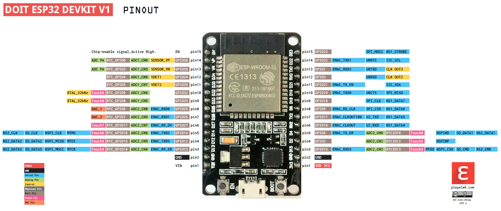
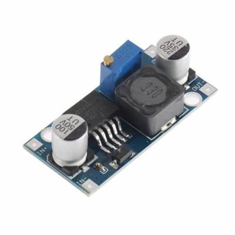
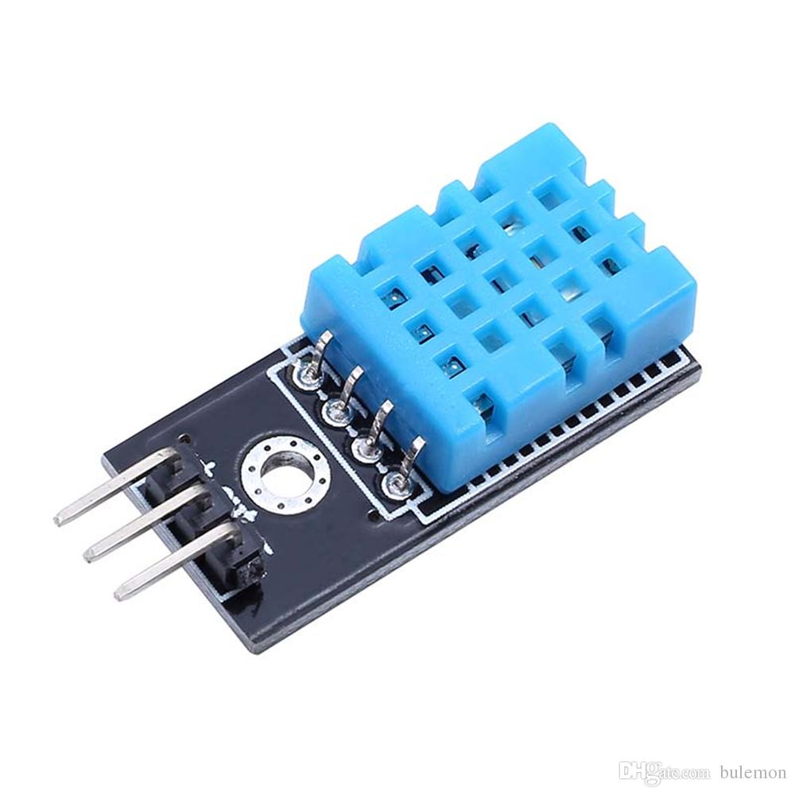

# Guia de Montagem e Configuração (Passo a Passo para Iniciantes)

Bem-vindo! Este guia foi feito para que **qualquer pessoa**, mesmo sem experiência prévia com programação, servidores ou eletrônica avançada, consiga montar e configurar o seu Nobreak Smart. Leia e siga os passos com calma.

---

## 💻 1. Preparando o "Cérebro" (Criando e Gravando o Tasmota)

A placa **ESP32** é o "cérebro" do projeto. Para ela funcionar, ler os sensores e conectar no Wi-Fi, ela precisa de um sistema interno (firmware) chamado **Tasmota**.
Como estamos usando sensores específicos, não podemos baixar a versão padrão. Vamos "criar" uma versão customizada usando uma ferramenta online chamada **TasmoCompiler**.



### Passo 1.1: Criando a sua versão do Tasmota (TasmoCompiler)

> [!TIP]
> 🚀 **Atalho: Baixe a versão pronta e homologada!**
> Se você não quiser passar pelo processo de compilação agora, eu já deixei os arquivos prontos, compilados e testados para você. Eles estão disponíveis na pasta `firmware` na raiz deste repositório e você pode baixá-los diretamente nos links abaixo:
> * 💾 [Clique aqui para baixar o firmware_factory.bin (Para primeira gravação via USB)](firmware/tasmota32.factory.bin)
> * 💾 [Clique aqui para baixar o firmware.bin (Apenas para atualizações futuras via Web)](firmware/tasmota32.bin)
>
> ⚠️ **Aviso Importante sobre a Versão:**
> Esta cópia pronta foi gerada em **14 de julho de 2026** utilizando o **Tasmota Versão 15.4.0**. Se você estiver lendo este manual muito tempo após essa data, esta versão pré-compilada pode estar desatualizada em relação às novidades e correções do Tasmota.
> * Recomendamos fortemente que, caso tenha passado muito tempo da data de criação acima, você ignore o atalho e siga o tutorial abaixo (Opção A ou Opção B) para gerar a sua própria versão atualizada e sob medida do zero!

Para compilar o seu firmware customizado, escolha uma das duas opções abaixo para abrir a ferramenta **TasmoCompiler**:

---

#### ➡️ Opção A: No Computador ou Servidor Local (Via Docker ou CasaOS)
Ideal se você prefere rodar tudo localmente ou já possui uma estrutura de servidor em casa.

* **Via Terminal do PC (Windows/Linux/Mac):**
  Abra o seu terminal (Prompt de Comando ou PowerShell) e execute o comando abaixo. Depois, acesse `http://localhost:3000` no seu navegador:
  ```bash
  docker run -ti --rm -p 3000:3000 benzino77/tasmocompiler
  ```

* **Via CasaOS:**
  1. No painel do seu CasaOS, clique em **App Store**.
  2. Clique em **Custom Install** (Instalação Personalizada) no canto superior direito.
  3. No campo **Docker Image**, digite: `benzino77/tasmocompiler`.
  4. No campo **Ports**, mapeie a porta do Host `3000` para a porta do Container `3000`.
  5. Dê o nome de `TasmoCompiler` ao aplicativo e clique em **Install**.
  6. Ao terminar, clique no ícone do TasmoCompiler no seu painel para abrir a ferramenta.

---

#### ➡️ Opção B: Na Nuvem Grátis (Via GitHub Codespaces)
Ideal se você não tem o Docker instalado e quer compilar de forma rápida e gratuita na nuvem, sem precisar baixar nenhum software no computador.

> [!WARNING]
> ⚠️ **ALERTA IMPORTANTE SOBRE CUSTOS E LIMITES:**
> O GitHub oferece **60 horas gratuitas por mês** de Codespaces para contas pessoais. Isso é mais do que suficiente para compilar o seu firmware.
> * **Você não será cobrado automaticamente** se as horas acabarem (o serviço apenas é pausado até o próximo ciclo mensal), a menos que você adicione manualmente dados de faturamento na sua conta.
> * **Não deixe o ambiente aberto sem necessidade:** Sempre que terminar, siga o Passo 7 para excluir o Codespace e interromper o contador de horas do sistema.

1. Acesse o seu [GitHub](https://github.com/), clique no botão **`+`** no topo direito e selecione **New repository** (Novo repositório).
2. No campo do nome, digite um nome temporário (sugestão: `meu-compilador-temp`), marque a visibilidade como **Private** (Privado) e clique em **Create repository**.
3. Na tela do repositório vazio que se abrir, localize o bloco **Start coding with Codespaces** (no topo esquerdo) e clique no botão **Create a codespace**.
4. Aguarde o ambiente terminar de carregar no seu navegador. No painel que se abrir, localize a aba **Terminal** na parte inferior, cole o comando abaixo e aperte **Enter**:
   ```bash
   docker run -d -p 3000:3000 benzino77/tasmocompiler
   ```

> [!TIP]
> ⏱️ **Dica para o servidor não dormir:** O GitHub desliga o servidor temporário automaticamente se detectar **30 minutos de inatividade**. Como ele só detecta atividade se você mexer na aba principal do Codespace (a tela preta do editor), evite demorar muito tempo na aba do compilador (porta 3000). 
> * **Se o servidor parar:** Não se preocupe, você não perdeu nada definitivo. Basta voltar na aba do Codespace, recarregar a página (F5) para o servidor acordar, e rodar o comando do Docker novamente no terminal.

5. Assim que o download terminar, o GitHub detectará que o sistema está pronto. Uma notificação aparecerá no canto inferior direito. Clique no botão azul **Open in Browser** (Abrir no Navegador).
   - *Dica:* Se a notificação sumir, vá na aba **Ports** (ao lado do Terminal), passe o mouse sobre a porta `3000` e clique no ícone do globo terrestre (**Open in Browser**).
6. O compilador visual abrirá em uma nova aba do navegador. Faça as configurações e baixe o seu arquivo `tasmota32.bin`.
7. **Limpeza da Nuvem (Essencial):** Para não consumir o limite de horas gratuitas da sua conta GitHub à toa, após baixar o arquivo, acesse [github.com/codespaces](https://github.com/codespaces), clique nos três pontinhos ao lado do codespace criado e selecione **Delete** (Excluir).

---

Após abrir o **TasmoCompiler** (por qualquer uma das opções acima), siga os passos abaixo para gerar seu firmware customizado:

2. **Passo 1 (Language):** Selecione o idioma **Portuguese (Brazil) (pt-BR)** para que toda a interface do seu nobreak fique em português. Clique em **Next**.
3. **Passo 2 (Chip Type / Board & Features):** Nesta tela, faremos a seleção do chip e limparemos todos os recursos desnecessários para garantir um sistema ultra-leve e estável:
   - **Tipo de ESP32 (Topo da tela):** Certifique-se de que a opção **Generic** está selecionada (correta para o ESP32 DevKit de 38 pinos clássico).
   - **Recursos na tela:** **Desmarque absolutamente tudo** nesta lista, mantendo ativada **APENAS** a caixa **Interface WEB** (que é obrigatória para conseguirmos acessar o painel do nobreak pelo navegador).
   - *Nota de Personalização:* Este guia foi projetado para um cenário de **monitoramento passivo** avançado, onde o foco é apenas ler os dados e enviá-los ao Home Assistant. Se o seu projeto exigir outras funções específicas no próprio ESP32 (como automações locais sem servidor, relés temporizados, etc.), você deve marcar recursos como "Regras", "Cronômetros" ou "Berry scripting" de acordo com a sua necessidade. Caso contrário, deixe tudo desmarcado para poupar memória e processamento.
   - Clique em **Next**.
4. **Passo 4 (Custom Parameters):** Esta é a parte mais importante. Você verá uma caixa de texto em branco. Copie e cole exatamente o código abaixo dentro dessa caixa:
   ```cpp
   #ifndef USE_DHT
   #define USE_DHT
   #endif
   #ifndef USE_INA226
   #define USE_INA226
   #endif
   #ifndef USE_INA219
   #define USE_INA219
   #endif
   ```
   *Essas linhas dizem ao compilador para incluir os drivers físicos dos sensores de calor (DHT) e os leitores de bateria (INA226) no chip.*
5. **Passo 5 (Compile):** Clique no botão **Compile** e aguarde a finalização do processo de criação do firmware.
6. Quando terminar, a ferramenta apresentará os arquivos gerados. Baixe o arquivo **`firmware_factory.bin`** (ou `tasmota32-factory.bin`) para o seu computador.
   > [!NOTE]
   > ❓ **Qual a diferença entre os arquivos gerados pelo compilador?**
   > * **`firmware_factory.bin` (Versão de Fábrica):** É o arquivo completo. Ele vem com o sistema do Tasmota, o gerenciador de inicialização (bootloader) e o mapa que organiza a memória do chip. **Use este arquivo para a primeira gravação via cabo USB.**
   > * **`firmware.bin` (Versão de Atualização):** É um arquivo mais leve que contém apenas o sistema em si. Ele serve para fazer atualizações sem fio (via Wi-Fi/OTA) no futuro, quando a placa já estiver rodando o Tasmota.

---

### Passo 1.2: Gravando o arquivo na Placa (Flashear)
1. Conecte o seu ESP32 no computador usando um cabo USB (tem que ser um cabo de dados; cabos muito antigos ou apenas de "carregar celular" não transmitem dados e a placa não será reconhecida).
2. Pelo navegador Google Chrome ou Microsoft Edge (outros navegadores podem não ter suporte a conexão serial USB), acesse o site: [Tasmota Web Installer](https://tasmota.github.io/install/).
3. Na tela principal, escolha a opção **Upload/Custom firmware** (Carregar firmware customizado).
4. Clique no botão azul **Connect** (Conectar).
5. Uma janelinha do navegador vai aparecer listando as conexões. Selecione a porta correspondente à sua placa (geralmente aparece como "Silicon Labs CP210x USB to UART Bridge" ou simplesmente "COM3", "COM4"). Clique em **Conectar**.
   * ⚠️ **Dica se der erro de conexão:** Se a conexão falhar ou disser que a placa não responde, **mantenha pressionado o botão marcado como "BOOT"** (ou "BOOT/IO0") na placa do seu ESP32 e clique em Conectar no site novamente. Assim que a gravação iniciar, você pode soltar o botão.
6. Selecione o arquivo **`firmware_factory.bin`** que você baixou no Passo 1.1 e clique para iniciar a gravação (Install / Flash).
7. Aguarde a barra chegar a 100%. Uma mensagem de sucesso será exibida. Pronto! A placa agora tem o sistema do Tasmota instalado.

---

### Passo 1.3: Conectando a Placa no seu Wi-Fi
1. Desconecte o ESP32 do computador e ligue-o em qualquer carregador de celular comum na tomada apenas para ligá-lo (ou mantenha-o no USB do PC).
2. Pegue seu celular ou notebook, abra as configurações de redes Wi-Fi disponíveis.
3. Você verá uma rede Wi-Fi sem senha chamada **`tasmota-XXXXXX-XXXX`** (onde X são números aleatórios). Conecte-se a ela.
4. A tela de login da rede deve abrir automaticamente. Se não abrir, abra o navegador de internet do celular e digite o endereço: `http://192.168.4.1` e aperte Enter.
5. Na tela que aparecer, você verá uma lista de redes Wi-Fi próximas.
6. Clique no nome do **Wi-Fi da sua casa** e, no campo abaixo, digite a **senha do seu Wi-Fi**.
7. Clique em **Save** (Salvar). A placa vai reiniciar para tentar se conectar no seu roteador doméstico.

---

### Passo 1.4: Descobrindo o IP do seu nobreak smart
Depois que a placa se conecta na rede da sua casa, ela ganha um novo endereço de rede (IP) do seu roteador. Para continuar configurando, você precisa descobrir esse endereço:
- **Método 1 (Celular):** Baixe o aplicativo gratuito **Fing** (disponível para Android e iOS). Conecte seu celular no mesmo Wi-Fi de casa e mande o aplicativo escanear a rede. Procure por um dispositivo chamado "Tasmota" ou que exiba o ícone da fabricante espressif. O aplicativo mostrará o IP (exemplo: `192.168.1.15`).
- **Método 2 (Roteador):** Acesse a página de configurações do roteador da sua casa (geralmente pelo IP `192.168.1.1` ou `192.168.0.1` atrás do aparelho), vá na lista de "Dispositivos Conectados" (DHCP Client List) e procure pelo nome "tasmota".
- **Método 3 (Computador):** Abra o prompt de comando (CMD) no Windows e digite `ping tasmota.local`. Se a rede da sua casa suportar mDNS, ele responderá mostrando o IP do dispositivo.

---

## 🔌 2. Esquema de Ligação dos Fios (Hardware)

⚠️ **CUIDADO!** Faça todas essas ligações com o nobreak **totalmente desligado e fora da tomada**. Não brinque com energia elétrica!

Nós vamos ligar fios de cabo flexível fino (jumpers) saindo dos pinos da placa ESP32 para cada um dos componentes.

### Alimentação Principal (Módulo LM2596)
O ESP32 opera internamente a 5V/3.3V. Se você ligar a placa direto na bateria do Nobreak (que tem 12V ou 24V), ela vai **queimar instantaneamente em segundos**. O módulo regulador LM2596 serve para baixar e manter a energia estável.



1. Localize a bateria do seu nobreak. 
2. Ligue um fio (preferencialmente vermelho) do polo POSITIVO (+) da bateria na entrada **IN+** do módulo LM2596.
3. Ligue um fio (preferencialmente preto) do polo NEGATIVO (-) da bateria na entrada **IN-** do módulo LM2596.
4. 🛑 **ETAPA CRÍTICA DE SEGURANÇA:** Não conecte nada no ESP32 ainda. Ligue o nobreak (apenas na bateria). Pegue um multímetro, mude para a escala de Tensão Contínua (DC Volts) e meça as saídas **OUT+** e **OUT-** do LM2596. Pegue uma pequena chave de fenda e gire o pequeno parafuso dourado no topo do bloco azul (potenciômetro) do LM2596. Gire até que a tela do multímetro marque exatamente **5.0 Volts**.
5. Desligue tudo. Agora que a saída está regulada em 5V seguros, solde ou conecte um fio do terminal **OUT+** no pino **VIN** (ou **5V**) do ESP32, e um fio do **OUT-** no pino **GND** do ESP32.

### Sensor da Bateria (INA226)
1. Conecte o pino **VCC** do sensor INA226 ao pino **3.3V** do ESP32.
2. Conecte o pino **GND** do sensor INA226 ao pino **GND** do ESP32.
3. Conecte o pino **SDA** do sensor INA226 ao pino **GPIO 21** do ESP32.
4. Conecte o pino **SCL** do sensor INA226 ao pino **GPIO 22** do ESP32.
5. Conecte o pino **VBS** (ou **VBUS**) do sensor ao polo **POSITIVO (+12V)** da bateria do nobreak usando um fio fino. *(Isso é necessário para ler a tensão real da bateria, já que o Shunt de 15A estará no polo negativo)*.
6. Com o resistor R100 removido da plaquinha do INA226, solde os dois fios finos de sinal do Shunt externo de 15A diretamente nos pinos pequenos **IN+** e **IN-** da fileira de baixo da placa. Ignore os furos grandes do topo.

### Sensor da Tomada (HLW8032)
1. Conecte o pino **VCC** do sensor HLW8032 ao pino **5V** (ou VIN) do ESP32.
2. Conecte o pino **GND** do sensor HLW8032 ao pino **GND** do ESP32.
3. Conecte o pino **TX** do sensor HLW8032 ao pino **GPIO 16** (RX2) do ESP32.

### Sensor de Calor (DHT11)


1. Conecte o pino **VCC** (às vezes marcado com um sinal de "+") do DHT11 ao pino **3.3V** do ESP32.
2. Conecte o pino **GND** (às vezes marcado com um sinal de "-") do DHT11 ao pino **GND** do ESP32.
3. Conecte o pino **DATA** (ou OUT/Sinal) do DHT11 ao pino **GPIO 4** do ESP32.

---

## 💻 3. Configurando os Pinos na Tela do Tasmota

Agora que a parte física está montada, precisamos ensinar ao Tasmota o que colocamos em cada pino.

1. Abra o navegador no seu computador ou celular e digite o IP do seu nobreak (que você descobriu no Passo 1.4).
2. Na página principal do Tasmota, clique no botão **Configuration** (Configuração) e depois em **Configure Module** (Configurar Módulo).
3. Na caixa de seleção chamada **Module type** (Tipo de Módulo), selecione a opção **Generic (18)**.
4. Clique em **Save** (Salvar). A placa vai reiniciar automaticamente para carregar essa estrutura genérica. Aguarde a página recarregar (cerca de 10 a 15 segundos).
5. Clique novamente em **Configuration** > **Configure Module**.
6. Agora, você verá uma lista de portas (GPIOs). Mude apenas as seguintes portas:
   - Na linha correspondente ao **GPIO4**, escolha na lista a opção `DHT11` (ou `DHT11/21/22`).
   - Na linha correspondente ao **GPIO16**, escolha na lista a opção `CSE7766 Rx`.
   - Na linha correspondente ao **GPIO21**, escolha na lista a opção `I2C SDA (1)`.
   - Na linha correspondente ao **GPIO22**, escolha na lista a opção `I2C SCL (1)`.
7. Clique em **Save** (Salvar). O ESP32 reiniciará uma última vez.
8. Ao voltar para a tela inicial do menu principal do Tasmota, você verá listado em tempo real: Temperatura (°C), Umidade (%), Tensão da rede AC (V), Corrente (A) e Potência (W).

---

## ⚙️ 4. Ajustando a Precisão (Calibração Matemática)

Os valores de energia que aparecem no começo costumam estar um pouco errados. Siga o procedimento de calibração para ter precisão cirúrgica:

### Calibrando o Sensor de Rede AC (HLW8032)
Para calibrar a rede elétrica da rua, você precisa conectar ao nobreak uma carga puramente resistiva que você saiba o consumo real (por exemplo, uma lâmpada incandescente comum de 60W ou um ferro de passar roupas que diga a potência exata na etiqueta).
1. Ligue o nobreak na tomada da parede com a carga ligada nas tomadas de saída dele.
2. Pegue um multímetro confiável, meça a voltagem da tomada da parede (exemplo: deu `222V`).
3. Na tela principal do Tasmota, clique no botão **Console** (Console de Comandos).
4. Na linha de digitação na parte inferior da tela preta, digite os seguintes comandos (apertando Enter após cada um):
   - `VoltageSet 222.0` *(mude 222.0 para a voltagem medida no seu multímetro)*
   - `PowerSet 60.0` *(mude 60.0 para a potência real em Watts da lâmpada/aparelho que ligou)*
   *O Tasmota calculará a calibragem da rede automaticamente com base nesses dois números e guardará na memória.*

### Calibrando o Sensor de Bateria DC (INA226 com Shunt)
Como substituímos a pequena resistência padrão da placa do INA por um Shunt de 15A para suportar a corrente alta do nobreak, a conta de corrente dele estará completamente errada na primeira inicialização.

Para tornar o nobreak **100% autossuficiente** e evitar que você tenha que alterar códigos internos do Home Assistant (o que poderia quebrar o sistema se digitado incorretamente), nós vamos calibrar a medição **diretamente dentro do Tasmota**.

O nosso Shunt externo é especificado para **75mV / 15A**. Aplicando a Lei de Ohm ($R = V / I$), descobrimos a resistência exata dele:
$$R = 0,075V / 15A = 0,005\text{ Ohms}$$ (ou 5 mΩ).

Para configurar isso no Tasmota:
1. Acesse o IP do nobreak pelo navegador.
2. No menu principal, clique em **Console**.
3. Na caixa de digitação na parte inferior, digite o seguinte comando e pressione **Enter**:
   - `Sensor54 1, 5` *(Isso configura a resistência do seu shunt de barra de 15A/75mV, que é de exatamente 5 miliohms)*

> [!NOTE]
> Se o seu módulo estiver utilizando o driver clássico do INA219 (em vez do INA226), substitua o comando `Sensor54` por `Sensor13` (exemplo: `Sensor13 11 0.005`, `Sensor13 12 15.0` e depois digite `Restart 1` no console para reiniciar).

#### 🔍 Como essa calibração funciona nos bastidores? (Sem Scripts ou Regras)
Você pode estar se perguntando: *Como o Tasmota faz esse cálculo sem precisarmos escrever regras complexas ou scripts de código?*
* O **INA226** não é um sensor "burro" analógico. Ele é um chip de monitoramento inteligente I2C que possui seus próprios **registradores físicos de hardware** (pequenas memórias internas dentro do próprio sensor).
* Quando você digita `Sensor54 1, 5` no console, o Tasmota calcula internamente o valor de calibração correspondente e **escreve esse valor diretamente nos registradores do chip INA** via barramento I2C.
* A partir daí, o próprio silício do sensor INA passa a multiplicar fisicamente os milivolts medidos no shunt pelo fator gravado em seu registrador.
* O Tasmota apenas lê o resultado final já calculado e processado. É por isso que não há atraso de processamento, não consome memória RAM do ESP32 e garante precisão cirúrgica de hardware!

A partir deste momento, o próprio ESP32 receberá todo o cálculo matemático pronto. A tela principal do Tasmota passará a exibir a Corrente (A) e a Potência (W) da bateria já calibradas com total precisão!

---

## 🏠 5. Central de Visualização (Standalone vs. Home Assistant)

Uma das maiores vantagens deste projeto é a flexibilidade. Você pode usá-lo como um monitor independente rápido (standalone) ou integrá-lo de forma completa e profissional ao seu Home Assistant.

> [!IMPORTANT]
> **Se você NÃO possui o Home Assistant ou não deseja integrá-lo a um sistema de automação:** Siga apenas o **Passo 5.1** e você terá um painel completo. Pode ignorar completamente o **Passo 5.2**!

### 5.1 Usando apenas a Interface do Tasmota (Sem Servidor)
Se você não possui um servidor de automação (como Home Assistant) e quer apenas monitorar o nobreak pelo celular ou computador:
1. **Personalize o Nome do Dispositivo:**
   - Na tela inicial do Tasmota, vá em **Configurações (Configuration)** > **Configurar Outros (Configure Other)**.
   - Nos campos **Nome do Dispositivo (Device Name)** e **Nome Amigável (Friendly Name 1)**, digite: `Nobreak Smart`.
   - Clique em **Salvar (Save)**. Agora o topo da página exibirá "Nobreak Smart" em vez de "Tasmota".
2. **Crie um Atalho:**
   - Abra a página do Tasmota no navegador do seu celular.
   - Toque nos três pontinhos do navegador (Chrome ou Safari) e selecione **Adicionar à tela de início** (ou "Instalar Aplicativo").
   - Um ícone com o nome "Nobreak Smart" aparecerá na tela do seu celular. Sempre que tocar nele, você abrirá a central com todas as informações de temperatura, tensão de entrada (AC), consumo em watts e carga de bateria instantaneamente.

---

### 5.2 Integrando ao Home Assistant (Via MQTT)
Se você tem o Home Assistant instalado e quer armazenar históricos, criar gráficos e receber alertas de queda de energia:

#### Passo 5.2.1: Configurando o MQTT no Tasmota
Para o nobreak conversar com o Home Assistant, precisamos conectá-lo ao servidor de mensagens (Broker MQTT):
1. Na tela inicial do Tasmota, clique em **Configurações (Configuration)** > **Configurar MQTT (Configure MQTT)**.
2. Preencha os campos exatamente como abaixo:
   - **Host:** O endereço IP do seu servidor do Home Assistant (ex: `192.168.1.100`).
   - **Porta:** `1883` (porta padrão do MQTT).
   - **Usuário (User):** O usuário que você criou no seu Broker MQTT do Home Assistant.
   - **Senha (Password):** A senha do usuário MQTT.
   - **Tópico (Topic):** `nobreak_smart`
3. Clique em **Salvar (Save)**. O nobreak vai reiniciar e se conectar ao Home Assistant.

#### Passo 5.2.2: Ativando a Integração no Home Assistant
Graças à calibração que fizemos direto no chip, **você não precisa alterar nenhuma linha no arquivo `configuration.yaml` do Home Assistant**. O dispositivo é descoberto de forma 100% plug-and-play!

1. **Verifique se você possui a integração do Tasmota instalada:**
   - Acesse o seu **Home Assistant**.
   - Vá em **Configurações (Settings)** > **Dispositivos e Serviços (Devices & Services)**.
   - Caso você **não tenha** a integração do Tasmota listada nesta página:
     - Clique no botão **Adicionar Integração (Add Integration)** no canto inferior direito da tela.
     - Digite **Tasmota** no campo de busca e selecione a integração Tasmota na lista.
     - Confirme a instalação. Ela se configurará automaticamente aproveitando a sua conexão ativa com o Broker MQTT do Home Assistant.
2. **Ativando o dispositivo descoberto:**
   - Uma vez instalada a integração, uma caixa cinza/azul com a logo do Tasmota aparecerá no topo da tela de Dispositivos e Serviços indicando que um novo dispositivo foi descoberto.
   - Clique no botão **Configurar (Configure)** dessa caixa e depois clique em **Enviar (Submit)** para confirmar.
3. **Pronto!** Todas as entidades físicas (Tensão AC, Consumo AC, Tensão da Bateria, Corrente Calibrada da Bateria, Potência da Bateria e Temperatura) serão geradas automaticamente e agrupadas sob um **único dispositivo chamado "Nobreak Smart"**.

#### Passo 5.2.3: Criando o Painel de Controle (Dashboard)
Para visualizar tudo de forma limpa e unificada (como um único dispositivo nobreak), basta criar um cartão do tipo **Entidades** no seu painel do Home Assistant usando as entidades que foram criadas sozinhas:

Cole este código no editor de código do seu painel Lovelace (Dashboard):

```yaml
type: entities
title: ⚡ Telemetria do Nobreak Smart
show_header_toggle: false
entities:
  - section: 🔌 Rede Elétrica (Entrada AC)
  - entity: sensor.nobreak_smart_cse7766_voltage
    name: Tensão da Tomada
  - entity: sensor.nobreak_smart_cse7766_power
    name: Consumo dos Equipamentos
  - section: 🔋 Bateria Interna (Sistema DC)
  - entity: sensor.nobreak_smart_ina226_voltage
    name: Tensão da Bateria
  - entity: sensor.nobreak_smart_ina226_current
    name: Corrente de Carga/Descarga
  - entity: sensor.nobreak_smart_ina226_power
    name: Potência na Bateria
  - section: 🌡️ Estado do Gabinete
  - entity: sensor.nobreak_smart_dht11_temperature
    name: Temperatura Interna
  - entity: sensor.nobreak_smart_dht11_humidity
    name: Umidade Interna
```

Esse painel agrupa todas as medições de entrada (AC), bateria (DC) e sensores ambientais de forma nativa e segura, sem que você precise digitar uma única linha de código no núcleo do Home Assistant!
